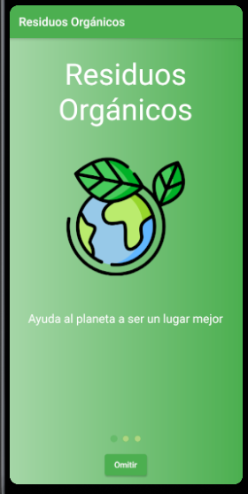

# Gestión de residuos orgánicos de florerías, fruterías y verdulerías en el municipio de Teziutlán

## Descripción del proyecto

El presente proyecto  tuvo como propósito diseñar una aplicación móvil dirigida al reciclaje de desechos orgánicos en la ciudad de Teziutlán, Puebla, como los residuos de florerías, fruterias e incluso algunos hogares. Se hizo una investigación previa para conocer la viabilidad del proyecto, tomando en cuenta las problemáticas:

# Maquetado

## Balsamic

# Capturas aplicación

# Ver documentación

<a href="4-DESARROLLO DE LA PROPUESTA DE SOLUCIÓN-SOFTWARE.pdf"> Ver documentación de propuesta de solucion</a>